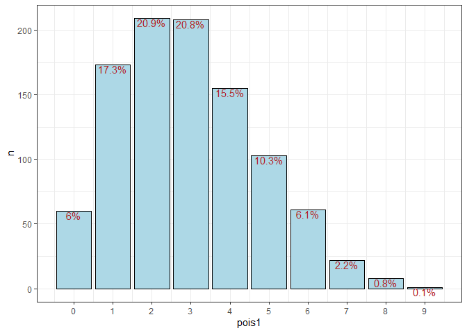
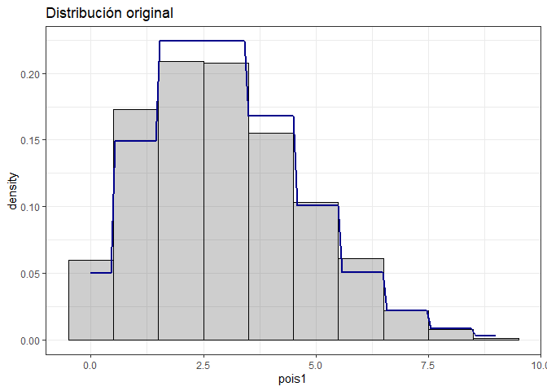

Untitled
================

# Distribuciones de probabilidad:

En general, cuando modelamos datos estamos asumiendo que existen parámetros que explican las principales caraterísticas de las observaciones. Ello supone que las observaciones tienen algún tipo de distribución probabilística a la cual queremos aproximarnos con una serie de estimadores que, mediante un modelo, permitan obtener información relevante respecto a los datos.

### Distribución Binomial:

La distribución Binomial se basa en eventos dicotómicos (llamados ensayos de Bernoulli), tales como lanzar una moneda, o ganar o no ganar un ticket ganador. Estos eventos tienen 𝔼(*x*)=*p* y 𝕍(*x*)=*p* ⋅ (1 − *p*). La distribución Binomial permite modelar escenarios con múltiples ensayos de Bernoulli, asumiendo una probabilidad constante entre ensayos e independencia entre ensayos.Nos permite responder preguntas como ¿cuál es la probabilidad de obtener 8 caras en 10 lanzamientos de una moneda.

La fórmula que nos permite calcular las probabilidades bajo una distribución binomial es:

$${n\\choose k}\\cdot p^{k}\\cdot(1-p)^{n-k}$$

Lo que estamos haciendo con esa fórmula es: multiplicar todas las formas posibles (combinaciones) en que puede ocurrir que observemos k eventos favorables (y por tanto n-k eventos no favorables) bajo una probabilidad dada. Si se está modelando un fenómeno particular, y se asume que cada evento es independiente entre sí y tiene igual probabilidad de modo que *X*<sub>*i*</sub> ∼ *B**e**r**n**o**u**l**l**i*(*p*), entonces se dice que *X* ∼ *B**i**n*(*n*; *p*), pudiendo estimarse su función de probabilidad acumulada (PMF).

Esta distribución tiene 𝔼(*X*)=*n* ⋅ *p* y 𝕍(*X*)=*n* ⋅ *p*(1 − *p*)

### Distribución de Poisson:

La distribución de Poisson es útil para estimar probabilidad de ocurrencia de una cierta cantidad de eventos que ocurren rara vez en un periodo corto de tiempo, por ejemplo, la probabilidad de anotar un gol en cada segundo de tiempo de un partido de futbol, o la probabilidad de que un computador falle en una unidad corta de tiempo. En realidad, en este caso no hay un límite superior, podría un equipo marcar 20 goles, de modo que la distribución binomial no se ajusta. En cada unidad mínima de tiempo existe una leve probabilidad de ocurrencia del evento, y podemos decir que hay infinitos eventos.

La función de probabilidad de esta distribución está definida por:

$$(\\frac{\\lambda^{x}}{x!})exp(\\lambda)$$

Esta distribución solo tiene un parámetro (*λ*), y tiene la particularidad de que 𝔼(*X*)=𝕍(𝕏)=λ. El parámetro *λ* es la cantidad de eventos esperada. Por ejemplo, si yo se que en promedio hay 3 goles por partido, podría estimar la probabilidad de que hayan 4 goles por partido, suponiendo que los goles por partido se distribuyen según *X* ∼ *P**o**i**s**s*(*λ*)

Podemos suponer que teóricamente la distribución de Poisson nos puede servir por el tipo de problema que intentamos resolver. Sin embargo, si tenemos datos disponibles, podemos comparar la distribución de Poisson con la distribución empírica. Supongamos que tenemos una base de datos con los goles anotados en mil encuentros de futbol, tal que la frecuencia de goles es la siguiente:

``` r
pois1=rpois(1000, 3)

data.frame(pois1) %>% count(pois1) %>% mutate(prop = n/sum(n)) %>% ggplot(aes(x=pois1, y=n)) +
  geom_col(fill="lightblue", color = "black") + geom_text(aes(label=paste0(prop*100, "%")), vjust=1, color = "firebrick") + theme_bw() + scale_x_continuous(breaks = seq(0,9))
```



Podemos comparar esta frecuencia con la distribución de Poisson, en este caso con un lambda igual a 3

``` r
ggplot(data = data.frame(pois1)) +
      geom_histogram(
        aes(x = pois1, y = after_stat(density)),
        color = "black",
        alpha = 0.3, binwidth = 1) +
      stat_function(
        fun   = function(.x){dpois(x = round(.x,0), lambda = 3)},
        color = "darkblue",
        size  = 1) +
      labs(title = "Distribución original") +
      theme_bw()
```


